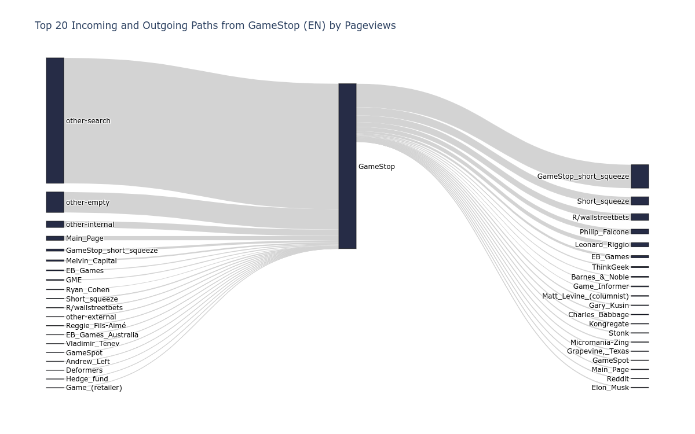

Hi! I am Muniza and this summer I'll be interning with [Wikimedia](https://www.wikimedia.org/) as an [Outreachy](https://www.outreachy.org) intern. Since I'll be blogging about it over the next three months, I want to talk a little bit about what this internship involves and why I decided to apply for it.

## What's Outreachy? ##  

Outreachy is a paid, remote internship program whose goal is to support people from groups underrepresented in tech. Applying to Outreachy involves the following steps:  

1. Filling out an initial application that determines your eligibility to be an Outreachy intern.
2. Once your initial application is approved, the contribution period will begin. This involves picking a few projects that look interesting to you and making contributions to them.  
3. Filling out a final application for each project you've recorded contributions for.
4. Getting selected as in intern.  

This process may sound daunting but projects usually have very clear instructions on how to contribute to them. Plus, you'll have mentors that will help you improve your contributions and fellow Outreachy applicants who are often happy to help you when you get stuck.  

## Why I decided to apply to Outreachy ##  

I can't exactly remember how I got introduced to open source but something about the idea of contributing to software that I use everyday has always fascinated me. However, getting started with open source can be intimidating because there are just so many unknowns: the tools, process, style, culture, and more. Outreachy helps make this experience less terrifying for newcomers by giving them the opportunity to work on relatively small, structured projects that don't feel overwhelming and introducing them to mentors from open source communities who are willing to help them become productive members of said communities.  
Another great thing about Outreachy is the application process. Even if you don't get selected as an intern, you still learn so much by just applying to projects and making contributions during the contribution period.  

## Wikimedia ##

    The Wikimedia Foundation is a nonprofit charitable organization dedicated to encouraging the growth, development and distribution of free, multilingual content, and to providing the full content of these wiki-based projects to the public free of charge.

Choosing what projects to apply to can be challenging because there are so many of them and all of them are very interesting. I decided to apply to Wikimedia because:  

1. I've grown up with Wikimedia Projects. Whether it be going on Wikipedia to learn more about a topic or stumbling on WikiBooks while studying for a college course, Wikimedia has been a constant presence in my life which is why contributing to it felt a bit more personal and familiar.

2. The project that I'm working on is pretty awesome :) (more on this in the next section).

## What I'll be working on ##

As part of my internship with Wikimedia, I'll be designing and developing a [tool for analyzing and visualizing reader navigation behavior](https://phabricator.wikimedia.org/T275608) on [Wikipedia](https://www.wikipedia.org) with the help of my mentors [Martin Gerlach](https://meta.wikimedia.org/wiki/User:MGerlach_(WMF)) and [Isaac Johnson](https://meta.wikimedia.org/wiki/User:Isaac_(WMF)). The data that will power the analyses and visualizations for this tool is the Wikipedia clickstream data, a public dataset about how frequently readers navigate certain links. This data is available as a monthly updated [dump](https://dumps.wikimedia.org/other/clickstream/readme.html) file for 11 languages.  
Wikipedia clickstream data can provide priceless insights into how readers browse Wikipedia contents. For example, it can help us identify common paths that readers take to and from an article.  
  
These insights can prove valuable for not only people who contribute to Wikipedia but also for researchers, educators and journalists, among others. This is why one goal for the tool that we'll be building is to make accessing these results a possibility for people who don't have the skills to glean them from raw data.  

### And so this is what I'll be writing about for a while... ###