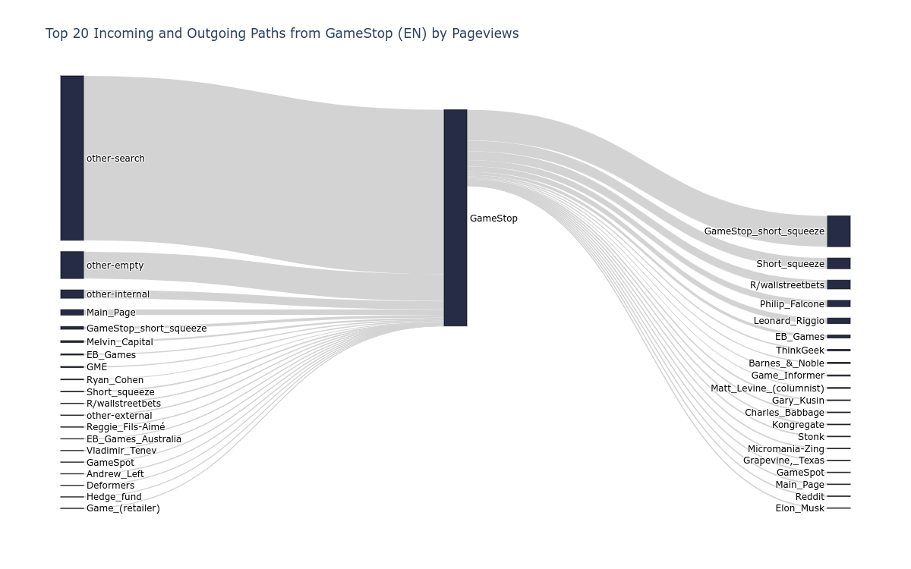
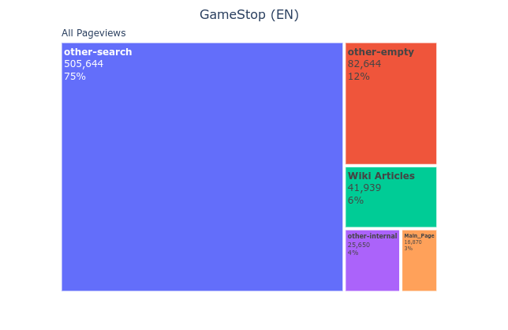
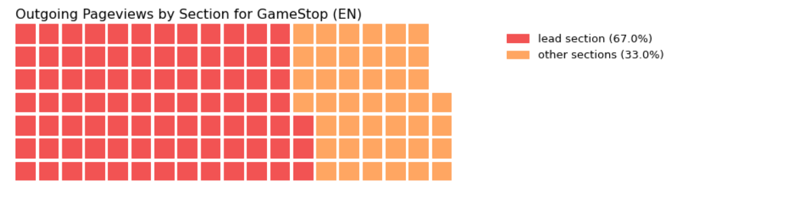

This summer I'll be interning with [Wikimedia](https://www.wikimedia.org/) as an [Outreachy](https://www.outreachy.org) intern. Outreachy is a paid, remote internship program whose goal is to support people from groups underrepresented in tech. If you've never contibuted to open source before, I highly recommend checking it out.  
As part of my internship with Wikimedia, I'll be designing and developing a [tool for analyzing and visualizing reader navigation behavior](https://phabricator.wikimedia.org/T275608) on [Wikipedia](https://www.wikipedia.org) with the help of my mentors [Martin Gerlach](https://meta.wikimedia.org/wiki/User:MGerlach_(WMF)) and [Isaac Johnson](https://meta.wikimedia.org/wiki/User:Isaac_(WMF)). The data that will power the analyses and visualizations for this tool is the Wikipedia clickstream data, a public dataset about how frequently readers navigate certain links. This data is available as a monthly updated [dump](https://dumps.wikimedia.org/other/clickstream/readme.html) file for 11 languages.  
Wikipedia clickstream data can provide priceless insights into how readers browse Wikipedia contents. For example, it can help us identify common paths that readers take to and from an article.  

Or it can reveal what sources send the most traffic to an article.  

It can also help us determine the percentage of outgoing clicks that come from each section of the article.  

And these are only some of the things we can do with this data. These insights can prove valuable for not only people who contribute to Wikipedia but also for researchers, educators and journalists, among others. This is why one goal for the tool that we'll be building is to make accessing these results a possibility for people who don't have the skills to glean them from raw data.  
