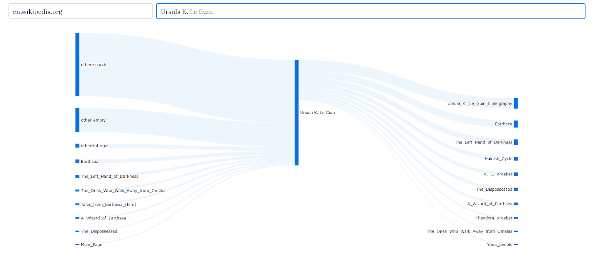
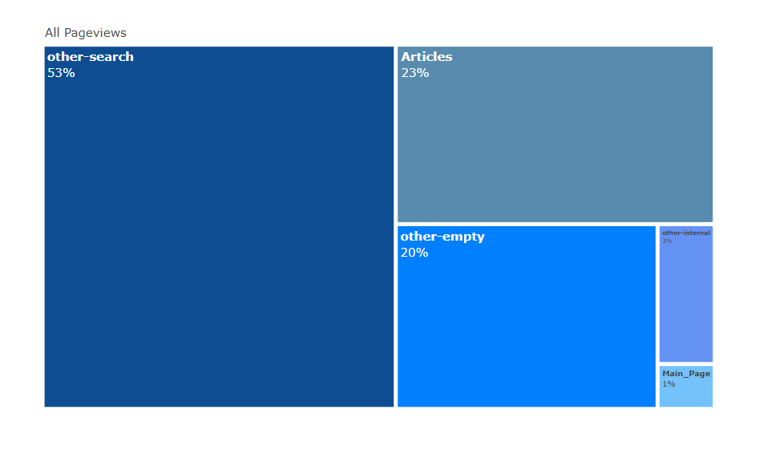
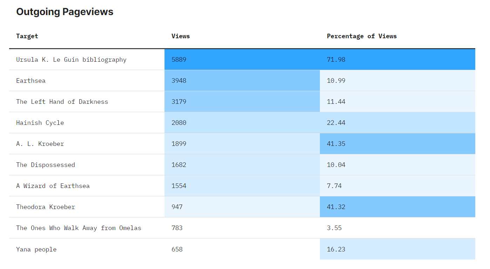
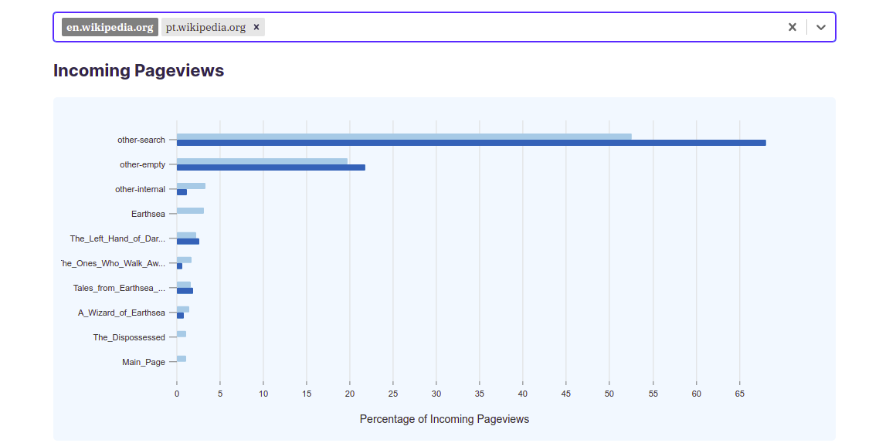

This week, I want to talk a little bit about the progress I've made so far on the clickstream analysis tool that I'm developing as part of my internship with Wikimedia. But before we get into that, here's little primer on the Wikipedia clickstream dataset and the tool itself.  
  
## What's Wikipedia Clickstream? ##  

The [Wikipedia clickstream](https://meta.wikimedia.org/wiki/Research:Wikipedia_clickstream) dataset contains data that shows how readers in Wikipedia get to an article and where they go from there. Essentially, it consists of weighted (source, destination) pairs extracted from the [webrequest logs](https://wikitech.wikimedia.org/wiki/Analytics/Data_Lake/Traffic/Webrequest) of Wikipedia. The logs themselves are considered sensitive information and get purged every 90 days, so this clickstream data is our only persistent source for getting insights into how readers navigate Wikipedia. The clickstream data only keeps (source, destination) pairs with at least 10 or more views to maintain anonymity and employs methods to filter out spider and bot traffic. It is maintained in [11 languages](https://dumps.wikimedia.org/other/clickstream/readme.html) and gets updated every month. These dump files vary in size and can be up to several gigabytes for more widely spoken languages.  
  
## Clickstream Analysis Tool ##

The clickstream analysis [tool](http://wn-api-test.toolforge.org) that we’re working on aims at making this clickstream data accessible to people other than just researchers, data scientists and programmers. As such, it processes these dumps to generate statistics such as top x pathways to and from a given article, distribution of incoming and outgoing traffic to a given article etc. and tries to present them in the form of easily understandable visualizations. This way, users can use this tool to gain insights from the clickstream data without having to process or analyze it themselves.

And now that that’s out of the way, we can talk about what this tool does so far and what’s next for it.

The tool currently lets you select a project such as en.wikipedia.org and an article in that project such as Ursula K. Le Guin & then generates the top 10 or 20 pathways to and from that article. This helps visualize the flow and distribution of traffic, such as what percentage of readers come to Ursula K. Le Guin from search engines and what article they’re the most likely to explore afterwards i.e. Ursula K. Le Guin Bibliography
  

  
Hovering on the links in that Sankey diagram gives you additional information such as what percentage of Earthsea’s traffic comes from Ursula K. Le Guin.
It also generates other visualizations such as treemaps to visualize the distribution of incoming traffic by referrers:
  

  
and heat maps that help understand the nature of the relationship between number of pageviews and percentage of total traffic. For example, Ursula K. Le Guin sends 5889 pageviews to Ursula K. Le Guin Bibliography, which makes up almost 72% of its traffic. In contrast, it sends 3948 pageviews to Earthsea, but this only makes up about 11% of its traffic. This illustrates the role an article plays in driving readership towards other articles.

  
Other features include the ability to compare distribution of traffic between the same article but for more than one project, such as pt.wikipedia.org and en.wikipedia.org. This can help users identify the differences between the contents of the same article across different languages and the differences between the behavior of readers speaking different languages while seeking information regarding a certain topic.

  
There’s still other visualizations that we want this tool to have and features that we think would make using this tool a better experience so don’t forget to check back in a week or so if you’d like to see what those visualizations and features are.  
